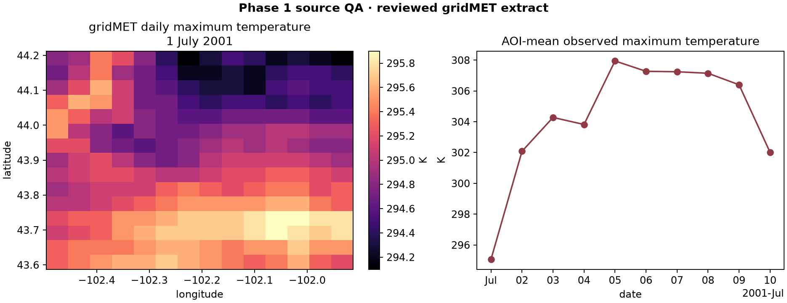
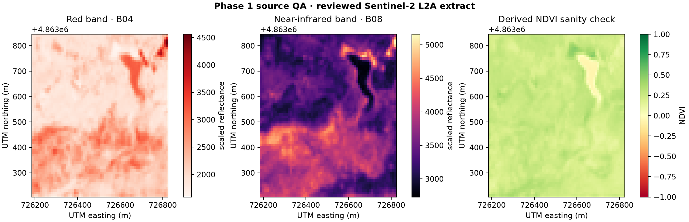

# Phase 1 source QA

Phase 1 establishes noun/source discovery and rationalizes the existing
gridMET, PRISM, and Sentinel-2 integrations. Each Phase 1 source adapter now
has a checksum-controlled real-data baseline, numerical checks, and a reviewed
figure. This does **not** imply that every variable or AOI has been validated.

The same evidence now certifies immutable CubeDynamics serving revisions. It
also records deterministic schema fingerprints and applies a reusable QA
profile before the source-specific scientific checks. See the
[source lifecycle and certification contract](../dev/source_lifecycle.md).

Separate from these production catalog baselines, the
[3DEP, roads and USGS streamflow projects](source_projects/index.md) test three
new source shapes. Their generated evidence is experimental; it does not add
serving revisions to this table or automatically register new public nouns.

## Current evidence status

| Source flavor | Serving revision | Reusable profile | Offline certification | Scheduled live endpoint test |
| --- | --- | --- | --- | --- |
| PRISM temperature | `temperature.prism@2026-08-26.1` | `climate_continuous_daily` | pass with documented caveats | yes |
| gridMET maximum temperature | `temperature.gridmet@2026-08-26.1` | `climate_continuous_daily` | pass with documented caveats | yes |
| Sentinel-2 B04/B08 and derived NDVI | `surface_reflectance.sentinel2@2026-08-26.1` | `continuous_raster_static` | pass with documented caveats | yes |

The pass applies to the exact products and bounded extracts named in the table.
Other gridMET variables still require variable-specific scientific QA.

## Reviewed PRISM result


The offline QA workflow checks:

- the NetCDF fixture SHA-256 against its provenance manifest;
- observational/source flags and explicit CRS;
- strictly increasing requested dates;
- finite values and nonempty dimensions;
- minimum temperature never exceeding maximum temperature;
- broad physical temperature bounds;
- coordinate bounds overlapping the documented AOI.

Machine-readable evidence:

- [PRISM result JSON](../assets/source_qa/prism_temperature.json)
- [Phase 1 source manifest](../assets/source_qa/manifest.json)
- [Underlying fixture provenance](https://github.com/CU-ESIIL/cubedynamics/blob/main/tests/fixtures/real_data/prism_boulder_january_2024.provenance.json)

## Reviewed gridMET result



The gridMET baseline checks the source and SHA-256 record, EPSG:4326 CRS,
strict daily dates, finite values, 1/24° resolution, known coordinate
orientation, requested bounds, and a broad physically plausible Kelvin range.

- [gridMET result JSON](../assets/source_qa/gridmet_temperature.json)
- [gridMET fixture provenance](https://github.com/CU-ESIIL/cubedynamics/blob/main/tests/fixtures/real_data/gridmet_badlands_july_2001.provenance.json)

## Reviewed Sentinel-2 result



The Sentinel-2 baseline checks source and checksum records, native UTM CRS,
B04/B08 availability, unique ordered acquisition dates, finite pixels, 10 m
spacing, coordinate orientation, provider reflectance scale, and NDVI bounds.
QA exposed duplicate STAC processing records for the same acquisitions; the
loader now keeps the record with the latest `s2:generation_time` while leaving
imagery lazy.

- [Sentinel-2 result JSON](../assets/source_qa/sentinel2_surface_reflectance.json)
- [Sentinel-2 fixture provenance](https://github.com/CU-ESIIL/cubedynamics/blob/main/tests/fixtures/real_data/sentinel2_badlands_june_2023.provenance.json)

## Reproduce it

```bash
python scripts/run_source_qa.py
```

The command writes fresh evidence to `artifacts/source_qa/`. CI runs it beside
the broader publication validation suite and uploads both artifact trees. The
checked website image and JSON were produced by pointing `--output` at
`docs/assets/source_qa` after review.

Each JSON result keeps its established fields and adds `qa_profile`,
`profile_result`, `schema_fingerprint`, `serving_revision`, and a structured
`certification` record. A fixture-level pass is an `offline_baseline`; live
source health remains a separate state and workflow.

## Remaining limitations

gridMET still retrieves annual files before client-side AOI selection, so a
server-side subset path should replace it before Phase 2 climate expansion.
The reviewed gridMET extract covers maximum temperature only. Sentinel-2 cloud
metadata are retained, but the baseline does not implement pixel-level cloud
masking and covers only one small South Dakota window. Live endpoint tests
remain separate because an offline fixture cannot detect provider outages.
Daymet remains outside implemented-source discovery. Its candidate and current
authentication blocker are documented on the [Daymet status page](../datasets/daymet.md).
