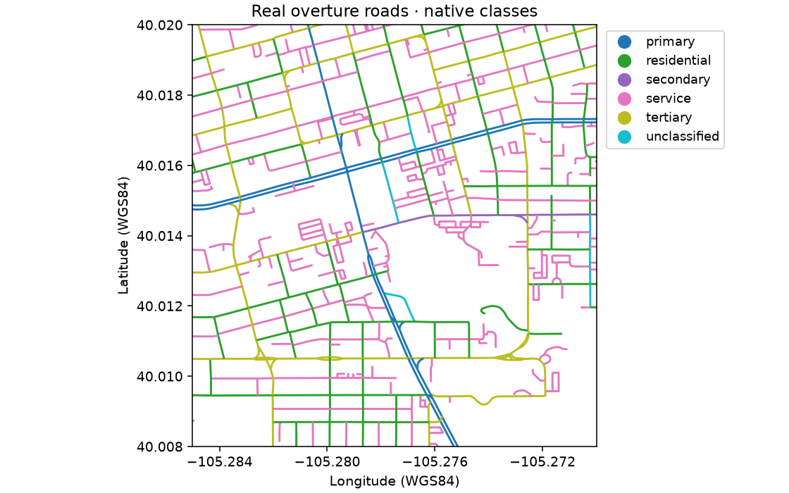
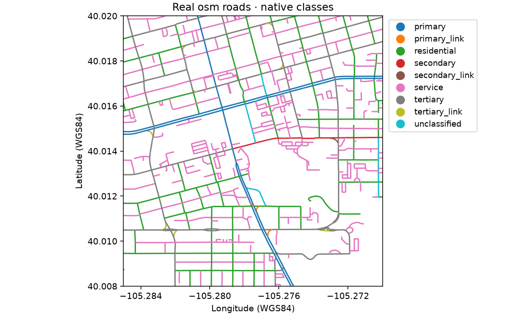
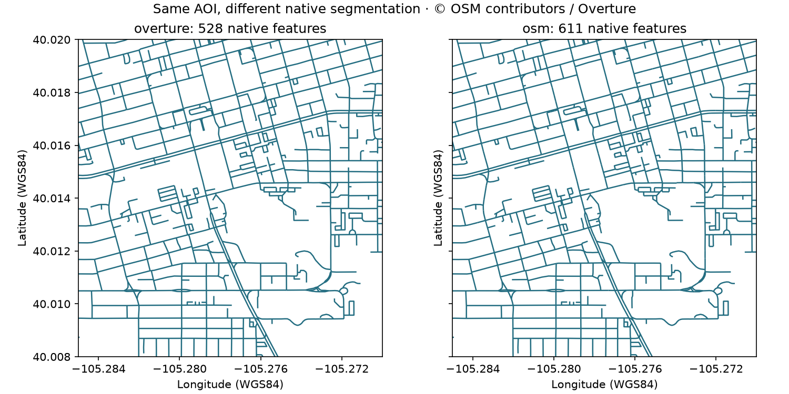

# Roads: one noun, two observation systems

**Current implementation:** the [bounded runtime candidates](production.md)
add explicit Overture releases, ETag-bound coalesced reads, retries and raw
snapshot replay. OSM remains a small interactive query route, not a reliable
application backend. The original comparison below is historical evidence.

A map can look almost identical while its feature counts and classifications
differ. Here **roads** means mapped linear road-like corridors, with source
identity, native classification, segmentation and attributes retained. It does
not mean a complete routable network or an automatically harmonized hierarchy.

The shared Boulder AOI is `[-105.285, 40.008, -105.270, 40.020]` (WGS84).

## Keep the analysis explicit

```python
from cubedynamics import pipe
from examples.source_projects.roads import roads, within_aoi_length

network = roads(source="osm")  # Or "overture"; explicit bounded online read.
# Clipping and metre-based measurement are visible analysis choices.
lengths = (pipe(network) | within_aoi_length()).unwrap()
network.plot(column="source_classification", legend=True)
```

Run `python -m examples.source_projects.roads.proof`. Overture additionally
needs `python -m pip install -r examples/source_projects/roads/requirements.txt`.
PyArrow is an optional project dependency, not a new core requirement.

## Two independent source proofs

**Overture:** the [official STAC catalog](https://stac.overturemaps.org/catalog.json)
selected release **2026-08-19.0**, transportation/segment, GeoParquet 1.1.0,
ODbL-1.0. File bounding boxes select one of 128 partitions; native Parquet bbox
statistics select three of its 128 row groups. A byte-capped anonymous range
reader transfers 19,872,693 Parquet bytes, including metadata. It never opens
the complete 350,469,378-feature collection as an in-memory dataset. The
catalog's schema version is null; the evidence preserves that absence alongside
the actual Arrow schema rather than inventing a version.

**OSM:** [Overpass](https://wiki.openstreetmap.org/wiki/Overpass_API/Overpass_QL)
at `https://overpass-api.de/api/interpreter` receives a bounded way query with
25-second server timeout, 32 MiB server-memory request, 5,001-feature sentinel
and 4 MB client-response cap. The exact query and OSM database timestamp are
in the record. Full way geometry and native tags survive; this is rolling
community data, not an immutable Overture-style release. Public Overpass is
an operational dependency, not a production planet-ingestion strategy.





## Inclusion, not a silent crosswalk

Both proofs include native `motorway`, `trunk`, `primary`, `secondary`,
`tertiary`, `residential`, `unclassified`, `service` and `living_street` classes.
OSM additionally includes its explicit major-road `_link` categories. Overture
must have `subtype=road`. Paths, tracks, trails, pedestrian/cycle-only classes,
rail, ferry and construction are excluded from this first contract. OSM area
features are excluded. These choices limit the comparison; they are not a
universal definition of roads or a statement that equal labels are equivalent.

The GeoDataFrame has `geometry`, `source`, `source_feature_id`,
`source_classification`, `name` and a JSON `native` field. Overture connectors,
restrictions, source attribution, rules and names remain inside native metadata;
OSM tags and node IDs do too. No missing tag is inferred. Empty/invalid line
geometry and duplicate IDs fail explicitly. Features intersect the AOI but may
extend beyond it. **Only the length comparison clips them**, in an explicit
project verb, then measures in Boulder-appropriate UTM 13N. No dissolving,
matching counts, repairing topology or resegmentation.

## What actually differed



The retrieved sample contained **528 Overture features and 611 OSM ways**.
Clipped mapped length was **43.115 km and 43.065 km**, respectively. Named
feature fractions were 56.1% and 58.9%; these are segmentation-dependent
statistics, not quality rankings. OSM exposed nine included classifications,
Overture six. Native source attributes and segmentation explain why counts
should not be treated as independent road inventories.

Overture itself incorporates OSM alongside other sources: the visual agreement
is **not independent ground-truth validation**. Attribution: © OpenStreetMap
contributors / Overture Maps; [Overture transportation guidance](https://docs.overturemaps.org/guides/transportation/).

## Architecture review

One minimal noun contract fits both GeoDataFrames. Geometry checks, explicit
clip/length analysis and `feature_line` QA are shared; discovery, filtering,
native schema, topology, identity and update behavior remain source-specific.
Both access paths worked in this run, but one run cannot rank reliability.
Snapshot identity is the Overture release plus partition assets; OSM requires
query, database timestamp, retrieval time and raw response retention.

No generic vector-source abstraction is justified by two adapters. Neither
source is promoted into public discovery: this is a project-owned
`roads(source=...)`, with independent [certification records](evidence.md),
not a promise that `cubedynamics.data.roads` exists.
