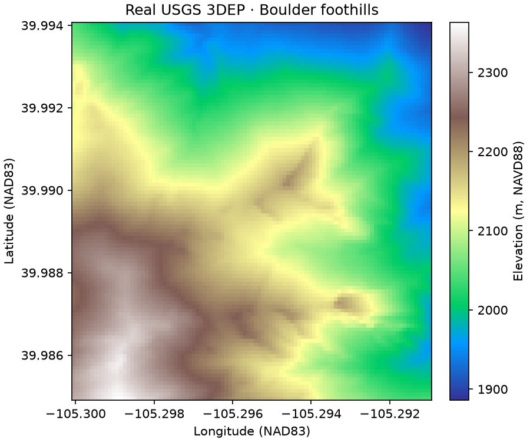

# 3DEP: read a landscape without downloading a tile

**Current implementation:** the [bounded runtime candidate](production.md)
enforces HTTP budgets through a Python range reader, rejects partial tile
coverage, and supports explicit catalog tile IDs. The original proof below
is historical access evidence, not a production certification.

The question is deliberately small: can we inspect terrain around the Boulder
foothills without downloading a roughly 413 MB elevation tile?

The project queries the authoritative
[USGS National Map catalog](https://tnmaccess.nationalmap.gov/api/v1/docs), using
the **1/3 arc-second Current** dataset tag. This identified tile
`USGS_13_n40w106_20260630.tif`, ScienceBase ID `6a471a0d1ba49bcdf785e0fa`.
The catalog-selected URL contains `/historical/`; this is why neither filenames
nor directory labels should replace catalog discovery.

## A small, explicit noun

```python
import json
from pathlib import Path
from cubedynamics import pipe, verbs as v
from examples.source_projects.three_dep.proof import elevation

# First run the proof command below to save the catalog discovery record.
tile = json.loads(Path("artifacts/source_qa/three_dep/catalog.json").read_text())["items"][0]
terrain = elevation(tile)  # Explicit bounded network read; a static y × x array.
mean_height = (pipe(terrain) | v.mean(dim=("y", "x"))).unwrap()
terrain.plot(cmap="terrain")
```

Run `python -m examples.source_projects.three_dep.proof` from the repository
root. Output is under `artifacts/source_qa/three_dep/`.

Requested WGS84 bounds: `[-105.300, 39.985, -105.291, 39.994]`. The adapter
transforms the bounds to the raster CRS, expands to full intersecting pixel
cells, clips to tile bounds, and preserves north-up rows. It rejects rotated or
unknown grids, no-overlap and windows exceeding 256 pixels per side before
reading values. No resampling, reprojection of values, or vertical conversion.



The returned array is 99×99 cells, EPSG:4269 (NAD83), with elevations in metres.
NAVD88 attribution comes from the catalog's CONUS product description, not an
independently verified tile-specific vertical-accuracy analysis. The native
nodata sentinel is preserved in provenance and masked in the array.

## Evidence and limits

The recorded GDAL log contains two data Range requests totaling **770,048
bytes**, both answered with HTTP 206. A separate 16,384-byte range preflight
and catalog metadata are additional overhead. The entire tile was not read or
written. Output metadata retains full source transform, pixel window, native
CRS, source shape, block shape, tile URL, catalog dates and identity. The
[generated record](evidence.md) contains numerical checks and review evidence.

This uses GDAL's direct remote raster path, not a custom download-and-crop
backend. Network-byte assertions are verified from the completed GDAL log;
the pre-read safety controls are window/block caps, range preflight and timeouts,
not a hard total-byte firewall around GDAL. This distinction is intentional.

## Architecture review

`continuous_raster_static`, xarray schemas and the ordinary pipe already fit.
Only tile discovery and geographic-window translation are source-specific.
A static field does not need a fabricated observation time to enter the grammar;
it cannot be handed to time-cube verbs that require time. This first proof is
limited to the Boulder tile and does not justify a general raster framework.

The candidate has no serving revision or public catalog registration. A future
public elevation source needs reviewed coverage/vertical-datum rules beyond
this tile. A successful tiny read is not national product certification.

[Roads project](roads.md) · [All project evidence](evidence.md)
