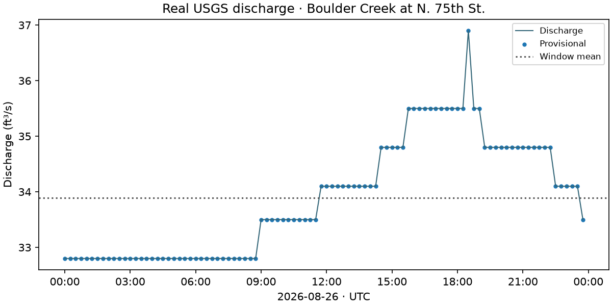

# USGS: observations that can change after retrieval

**Current implementation:** the [bounded runtime candidate](production.md)
adds pagination, time batching, native status fields, raw snapshots and offline
replay. [Run the streamflow lesson](../../vignettes/streamflow_snapshots.ipynb).
The one-day project proof below records the earlier access experiment.

Streamflow is discharge through time at a monitoring location. This project
tests one rolling observational source, using the modern
[USGS Water Data OGC API](https://api.waterdata.usgs.gov/docs/ogcapi/), not legacy
WaterServices. Anonymous access succeeded; no keys, login or backend fallback.

## One station, one day, one parameter

The proof uses **USGS-06730200**, Boulder Creek at North 75th Street near Boulder,
Colorado, for **2026-08-26 00:00:00–23:59:59 UTC**, parameter **00060**. The
`/ogcapi/v0/collections/continuous/items` request contains all three filters:
`monitoring_location_id`, `parameter_code` and `time`, plus `limit=2000`.
It returned 96 instantaneous observations, in **ft³/s**, at 15-minute intervals.

```python
from cubedynamics import pipe, verbs as v
from examples.source_projects.usgs.proof import streamflow

flow = streamflow(source="usgs", site="USGS-06730200",
                  start="2026-08-26T00:00:00Z", end="2026-08-26T23:59:59Z")
mean_flow = (pipe(flow) | v.mean(dim="time")).unwrap()
flow.streamflow.plot(x="time")
```

This is a project-owned noun, not yet `cubedynamics.data.streamflow`. The
explicit network read yields a `time × station` Dataset; no fake spatial cube
or hidden conversion to SI units. Run `python -m examples.source_projects.usgs.proof`.



All 96 observations were **Provisional**; qualifiers were present but null.
Values ranged from 32.8 to 36.9 ft³/s, with no missing, infinite, negative or
duplicate values. There were no gaps above the provider's 72-minute gap
threshold. These structural checks do not prove hydrologic accuracy or impose
a universal discharge plausibility range. The isolated high value is retained,
not smoothed away or labeled erroneous without evidence.

## The metadata is part of the noun

The same modern API's `monitoring-locations/items/{site}` and
`time-series-metadata/items/{id}` supplied site/series identity. Series ID:
`a36b95ef8f7140a3828b4e7c376bc4b5`; statistic `00011`, computation
`Instantaneous` / `Points`. Metadata includes site name/type, WGS84 point
(-105.178333, 40.051667), HUC 101900050601, Colorado, altitude/datum fields,
native original datum, series begin/end, thresholds and last-modified values.
Those native metadata are retained as JSON, not independently reinterpreted
as a station-status guarantee or an elevation conversion.

Native approval status, qualifier and last-modified fields remain coordinates
encoded as JSON strings (`"Provisional"`, `"Approved"`, `null`, etc.). Decode
with `json.loads`; null is not approval. Record UUIDs are also retained. Missing
status is exposed rather than guessed; provisional data emit a warning but are
never silently dropped. Raw response/checksum retention supports exact audit.

## Interpretation is not observation content

The [current continuous queryable schema](https://api.waterdata.usgs.gov/ogcapi/v0/collections/continuous/queryables?f=json)
says observation record UUIDs and last-modified fields can change during normal
database refreshes, even without measurement changes. The stable observation
key is **time-series ID plus time**. Neither a UUID nor retrieval date is a
scientific serving version.

The existing rolling lifecycle already handles content extension. The narrow
`OBSERVATION_UPDATE` classification now handles routine provisional/value/status
refreshes: retain and compare retrieved content, without creating a new rolling
serving interpretation. Declared product-wide historical revisions, schema
changes and semantic changes retain their existing review requirements.

A serving revision would version this adapter's scientific interpretation.
None is assigned in this candidate proof. A historical query tomorrow is **not
guaranteed byte-identical**; observed status, retrieval time, raw response hash
and native metadata make that limitation inspectable. This does not require a
generic time-series framework.

## Safety and remaining limits

The noun requires one site, explicit timezone-aware bounds of at most three
days, one parameter, at most 2,000 rows and byte-capped responses. Empty,
malformed, duplicate, wrong-site/parameter, inconsistent-unit or ambiguous
multi-series results fail. Pagination is explicit: a next page or incomplete
count rejects the partial result and asks for a shorter interval; it never
chases unlimited pages. Rate limits and outages are access blockers, not
retroactive scientific invalidation. API keys may increase provider limits but
are deliberately not used by this proof.

Only this station/day and the returned status behavior have live evidence.
Approved/null status paths are deterministic unit controls, not additional
live observations. Station completeness and suitability for flood, water
allocation or regulatory decisions remain outside this proof.

[Generated certification evidence](evidence.md) · [Source lifecycle](../../dev/source_lifecycle.md)
