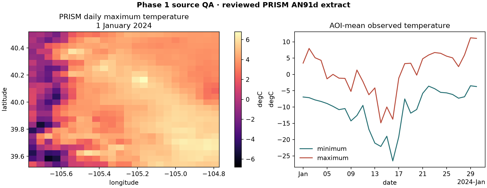

# prism · methods and QA examples

Provider, product, coverage, units and source status have one canonical home:
[prism source reference](../library/sources/prism.md).
This page preserves the operational example, reviewed figure and source citations.

## Quickstart

PRISM acquisition is currently daily. Use `freq="D"`; unsupported monthly
frequencies raise before network access rather than being silently aggregated.

### Get the stream (CubeDynamics grammar)

```python
import cubedynamics as cd
from cubedynamics import pipe, verbs as v

cube = cd.load_prism_cube(
    variable="ppt",
    start="2020-01-01",
    end="2020-02-01",
    bbox=[-105.4, 39.8, -105.0, 40.2],
    freq="D",
)

pipe(cube) | v.mean(over="time") | v.plot()
```

### Customizing the view

```python
pipe(cube) | v.plot(camera={"eye": {"x": 2.2, "y": 1.6, "z": 1.3}})
```

### Reviewed source-QA plot



This is a checked-in rendering of a real, checksum-controlled PRISM extract,
not synthetic example data. The accompanying QA checks provenance, CRS, time
ordering, finite coverage, physical temperature bounds, minimum/maximum
consistency, and overlap with the requested area of interest.

### Reproduce the validation

Run the publication QA workflow from the repository root:

```bash
python scripts/run_source_qa.py
```

The command writes the figure and a machine-readable result to
`artifacts/source_qa/`. See the [Phase 1 source-QA report](../data/phase1_qa.md)
for the exact checks, evidence, and current limitations.


### Citation
Daly, C., Halbleib, M., Smith, J. I., Gibson, W. P., Doggett, M. K., Taylor, G. H., Curtis, J., & Pasteris, P. P. (2008). Physiographically sensitive mapping of climatological temperature and precipitation across the conterminous United States. *International Journal of Climatology*, 28(15), 2031–2064. https://doi.org/10.1002/joc.1688

---
Back to [Datasets Overview](index.md)  
Next recommended page: [Which dataset should I use?](which_dataset.md)
