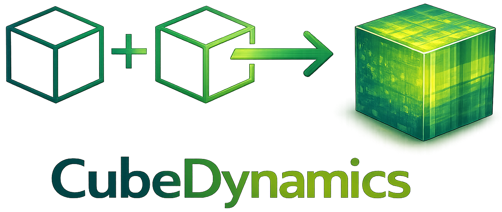

<div class="hero-logo cd-hero-logo">
  
</div>

# CubeDynamics: a composable grammar of operations for spatiotemporal data cubes.

Keep spatial and temporal dimensions together so you can reason about **space, time, scale, and events** without breaking your workflow apart. Use it to build reproducible pipelines that stream or analyze cubes in memory.

<div class="interactive-embed">
  <iframe
    src="/cubedynamics/assets/figures/ndvi_1_year.html"
    title="Interactive NDVI cube (1 year)"
    loading="lazy"
  ></iframe>
  <p class="interactive-embed__fallback">
    If the interactive view doesn’t load,
    <a href="/cubedynamics/assets/figures/ndvi_1_year.html" target="_blank" rel="noopener">open it in a new tab</a>.
  </p>
</div>

## Jump into the docs
<div class="ccm-card-grid">
  <a class="ccm-card" href="concepts/">
    <div class="ccm-card-title">Concepts</div>
    <div class="ccm-card-text">Learn the cube abstraction, pipes, verbs, and the grammar that ties them together.</div>
  </a>
  <a class="ccm-card" href="quickstart/">
    <div class="ccm-card-title">Getting Started</div>
    <div class="ccm-card-text">Install the package, configure your environment, and run a minimal pipeline.</div>
  </a>
  <a class="ccm-card" href="capabilities/">
    <div class="ccm-card-title">Capabilities</div>
    <div class="ccm-card-text">Survey available verbs with examples that show how they compose.</div>
  </a>
  <a class="ccm-card" href="datasets/">
    <div class="ccm-card-title">Datasets</div>
    <div class="ccm-card-text">Find supported sources, their semantics, and how to choose among them.</div>
  </a>
  <a class="ccm-card" href="recipes/">
    <div class="ccm-card-title">Recipes</div>
    <div class="ccm-card-text">Follow guided workflows and adapt the recipe template to new analyses.</div>
  </a>
  <a class="ccm-card" href="viz/">
    <div class="ccm-card-title">Visualization</div>
    <div class="ccm-card-text">Use cube-aware plotting and mapping verbs for inspection and reporting.</div>
  </a>
</div>

Looking for specific interfaces? Jump to the [API Reference](api/) or the [Contributing / Development](dev/contributing.md) guidelines.

If you feel lost, start with the [Documentation Overview](overview.md) or pick a path from [Reading Paths](reading_paths.md).

Need dataset attribution? See [Dataset citations](datasets/citations.md).

## Why CubeDynamics Exists
Most environmental datasets already *are* data cubes:
- climate grids evolving through time
- vegetation indices measured repeatedly over landscapes
- disturbance footprints (fires, droughts, floods) unfolding in space and time

But most workflows **break the cube apart**:
- spatial analysis happens in GIS
- temporal analysis happens in tables
- statistics happen elsewhere
- visualization happens last

CubeDynamics keeps these dimensions **together**.

The result is a framework that lets you ask questions like:
- *How does climate variability change inside vs. outside an event?*
- *Where and when does synchrony emerge across a landscape?*
- *How does variance propagate through space over time?*

These are fundamentally **spatiotemporal questions**—and they require spatiotemporal tools.

## What Is a Climate Data Cube?
A **climate data cube** is a 3-dimensional object:

```
value(x, y, time)
```

Instead of treating space and time separately, CubeDynamics treats them as **co-equal axes** of analysis.

This allows operations like:
- computing statistics *through time at every pixel*
- aggregating *space through time*
- extracting *volumes* rather than slices
- defining events as **regions in space–time**

The cube is not just a storage format.
It is the **unit of reasoning**.

## What CubeDynamics Enables
### Spatiotemporal Operations
Operations are defined on the cube itself—not on slices or tables derived from it.

Examples:
- anomalies
- rolling statistics
- variance and synchrony
- trends and seasonality

### Grammar-Based Pipelines
Analyses are expressed as **composable pipelines**:

```python
from cubedynamics import pipe, verbs as v

result = (
    pipe(cube)
    | v.anomaly()
    | v.variance()
    | v.plot(title="Spatiotemporal Variance")
)
```

This makes workflows readable, reproducible, inspectable, and easy to extend.

### Streaming-First by Design
Large datasets are handled via VirtualCubes that stream data chunk-by-chunk instead of loading everything into memory.

The same code works for:
- small local datasets
- continental-scale climate archives
- cloud-hosted data

### Event-Based Analysis
Events like fires, droughts, or phenological windows are treated as volumes in space–time, not just polygons or date ranges.
This enables:

- inside vs. outside comparisons
- event-aligned climate analysis
- causal framing of spatiotemporal patterns

## Who This Is For
CubeDynamics is designed for:

- Climate & Earth system scientists
- Ecologists and macrosystems researchers
- Environmental data scientists
- Anyone working with gridded time series data

If your data has space and time, and your questions involve structure, scale, or dynamics, this framework is for you.

## A Minimal Example
```python
from cubedynamics import pipe, verbs as v

result = (
    pipe(cube)
    | v.anomaly()
    | v.variance()
    | v.plot(title="Spatiotemporal Variance")
)
```

## Canonical Example
A typical analysis computes climate anomalies within an event footprint and compares them to surrounding conditions while preserving space–time structure. The example below summarizes that workflow.


## Next Steps
- [Concepts](concepts/index.md)
- [Getting Started / Quickstart](quickstart.md)
- [Recipes / How-tos](recipes/index.md)
- [API Reference](api/index.md)
