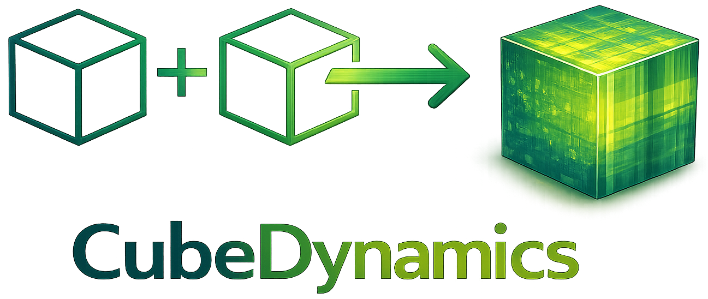

<div class="hero-logo cd-hero-logo">
  
</div>

# CubeDynamics: a grammar of streaming environmental computation

CubeDynamics provides a consistent interface for accessing, transforming, and analyzing **environmental data streams**.

It is designed for:

- scientists
- notebooks
- cloud workflows
- AI agents

Scientists and AI agents use the same streaming interface. The grammar is intentionally simple so humans and agents can reason about the same operations.

## What CubeDynamics Is

CubeDynamics sits between data access and scientific results:

```text
Data Sources
    ↓
Streaming Interface
    ↓
Grammar of Computation
    ↓
Scientific Results
```

It helps you compute on environmental streams without forcing you to build or manage a storage platform first.

## What CubeDynamics Is Not

CubeDynamics is not:

- a storage platform
- a data catalog
- a file format
- an Earth observation archive
- a visualization library

CubeDynamics operates **above** those systems. It can use them, but it is not trying to replace them.

## The Core Distinction

Most cube systems answer:

> How do I store, query, or retrieve a cube?

CubeDynamics answers:

> How do I compute on a stream of environmental data?

The cube is not the product.

The grammar is not the product.

The stream is not the product.

The product is the combination of **streaming + grammar**.

## Core Workflow

Every major CubeDynamics workflow reduces to a small, composable pattern:

```python
from cubedynamics import pipe, verbs as v

cube = load_data(...)

result = (
    pipe(cube)
    | v.anomaly()
    | v.aggregate()
    | v.detrend()
)
```

The same interface can be executed interactively, scripted in a notebook, run in cloud jobs, or orchestrated by agents.

## Quick Comparison

| Tool | Primary Role |
| --- | --- |
| `xarray` | Array operations |
| `cubo` | Build Earth-system cubes |
| Open Data Cube | Data storage and indexing |
| Google Earth Engine | Planetary geoprocessing |
| CubeDynamics | Streaming environmental computation |

CubeDynamics complements these tools by focusing on computation workflows over environmental streams.

## Why This Matters

Environmental analysis is often framed as:

```text
data source → storage system → cube
```

CubeDynamics is framed instead as:

```text
data source → streaming interface → computation grammar → result
```

That difference matters when you want to:

- work without managing massive local datasets
- compose scientific transformations as readable workflows
- move between local, cloud, and STAC-backed sources with one mental model
- let scientists and AI systems operate on the same abstraction

## Jump Into The Docs

<div class="ccm-card-grid">
  <a class="ccm-card" href="why_cubedynamics/">
    <div class="ccm-card-title">Why CubeDynamics?</div>
    <div class="ccm-card-text">Understand the strategic position: streaming computation, not storage, cataloging, or visualization.</div>
  </a>
  <a class="ccm-card" href="streaming/">
    <div class="ccm-card-title">Streaming Environmental Data</div>
    <div class="ccm-card-text">Start with the streaming model, VirtualCubes, and how local, cloud, and STAC-backed sources fit in.</div>
  </a>
  <a class="ccm-card" href="grammar/">
    <div class="ccm-card-title">Grammar of Streaming</div>
    <div class="ccm-card-text">Learn `pipe`, verbs, lazy evaluation, and workflow composition.</div>
  </a>
  <a class="ccm-card" href="workflows/">
    <div class="ccm-card-title">Workflows</div>
    <div class="ccm-card-text">See climate, fire, vegetation, and remote sensing analyses built on the same grammar.</div>
  </a>
  <a class="ccm-card" href="synchrony/">
    <div class="ccm-card-title">Synchrony</div>
    <div class="ccm-card-text">Explore state cubes, event catalogs, four synchrony primitives, and climate-biology coupling.</div>
  </a>
  <a class="ccm-card" href="datasets/">
    <div class="ccm-card-title">Datasets</div>
    <div class="ccm-card-text">Review supported sources after the computation model is clear.</div>
  </a>
  <a class="ccm-card" href="dev/contributing/">
    <div class="ccm-card-title">Developer</div>
    <div class="ccm-card-text">Read the design and implementation guidance behind the streaming-first architecture.</div>
  </a>
</div>

## 30-Second Summary

Within the first few minutes, you should be able to tell:

1. CubeDynamics is not another cube storage system.
2. It is not another visualization package.
3. It is a grammar of streaming environmental computation.
4. It works for both scientists and AI agents.
5. It can operate on environmental data without requiring you to manage massive local datasets.
