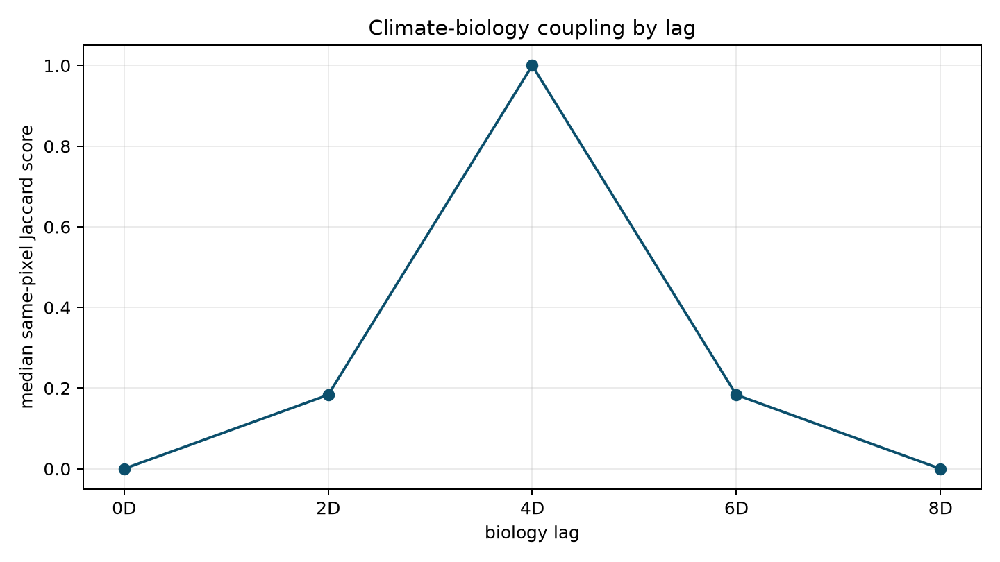
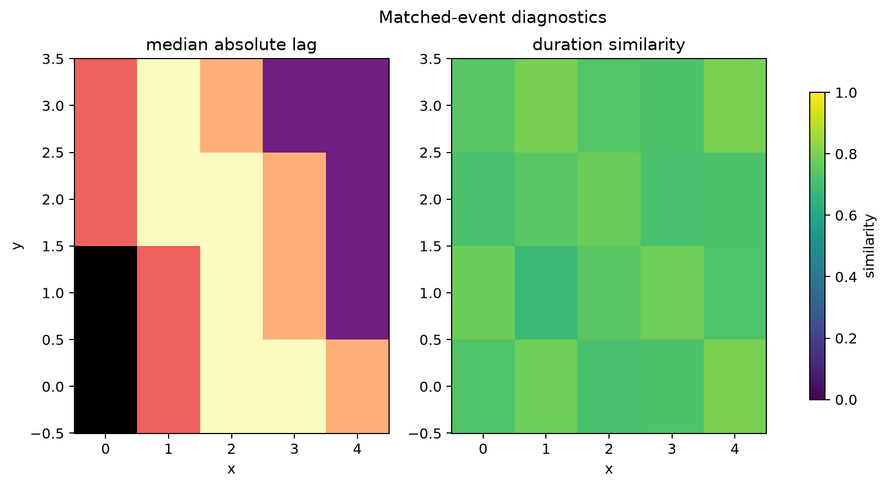

---
hide:
  - navigation
  - toc
---

<section class="cd-editorial-hero">
  

    
 Open-source · grammar-first · streaming-aware

    <h1>Make cubes <em>speak.</em></h1>
    
CubeDynamics turns spatiotemporal data into readable scientific stories—one composable verb at a time.

    

      <a class="cd-action cd-action--acid" href="vignettes/">Run a vignette ↗</a>
      <a class="cd-action cd-action--ghost" href="grammar/">Meet the grammar →</a>
    

  

  

    

    

    

      

        cube
        time · y · x
      

      

        +
        <strong>verb()</strong>
      

      

        result
        lazy · named · ready
      

    

    
A small grammar. A huge field of view.

  

</section>

<section class="cd-manifesto">
  
The big idea

  <h2>The grammar is the core. Projects bring the verbs.</h2>
  

    
Environmental science already has arrays, catalogs, renderers, and cloud archives. CubeDynamics gives them a shared language for computation.

    
Wrap a cube. Apply a verb. Keep space, time, metadata, and intent visible. Build project-specific vocabularies without turning every scientific assumption into framework code.

  

</section>

<section class="cd-grammar-strip" aria-label="CubeDynamics grammar example">
  

    
One line, many scales

    <h2>Readable enough to reason about.</h2>
  

  

    

    <pre><code>from cubedynamics import pipe, verbs as v

result = (
    pipe(cube)
    | v.anomaly(dim="time")
    | v.mean(dim=("y", "x"))
).unwrap()</code></pre>
    
NumPy-sized today. Dask-backed tomorrow. The expression stays legible.

  

</section>

<section class="cd-stories">
  

    

      
Start with a story

      <h2>See the grammar doing science.</h2>
    

    
Runnable notebooks, project vocabularies, and research workflows—each built on the same small compositional idea.

  

  

    <a class="cd-story cd-story--feature" href="vignettes/grammar_basics/">
      

        PIPE
        |
        VERB
      

      

        
01 · Runnable notebook

        <h3>The core grammar</h3>
        
Build a deterministic cube, compose public verbs, and unwrap the result—offline, in minutes.

        Open the vignette ↗
      

    </a>

    <a class="cd-story" href="vignettes/lazy_composition/">
      

        
      

      

        
02 · Streaming mindset

        <h3>Lazy by design</h3>
        
Watch Dask-backed data stay lazy across an ordinary CubeDynamics pipeline.

        Follow the computation ↗
      

    </a>

    <a class="cd-story" href="extending/custom_verbs/">
      

        
      

      

        
03 · Extend the language

        <h3>Your science, your verbs</h3>
        
Turn a project’s methods and assumptions into a small, tested vocabulary.

        Build a project verb ↗
      

    </a>
  

</section>

<section class="cd-layers">
  

    
Know what you are using

    <h2>One ecosystem. Four clear layers.</h2>
  

  <ol class="cd-layer-list">
    <li>01
<strong>Core grammar</strong>
<code>pipe</code>, <code>Pipe</code>, verb factories, and cube contracts.

</li>
    <li>02
<strong>Shared vocabulary</strong>
Common operations such as anomaly, mean, variance, and z-score.

</li>
    <li>03
<strong>Integrations</strong>
Data adapters, streaming execution, files, and renderers.

</li>
    <li>04
<strong>Project extensions</strong>
Synchrony, biology, Fire VASE, and the verbs your project owns.

</li>
  </ol>
</section>

<section class="cd-final-cta">
  
Ready to move?

  <h2>Bring a cube. <em>Leave with a workflow.</em></h2>
  

    <a class="cd-action cd-action--dark" href="quickstart/">Get started ↗</a>
    <a class="cd-text-link" href="concepts/core_and_projects/">Understand core vs. projects →</a>
  

</section>

