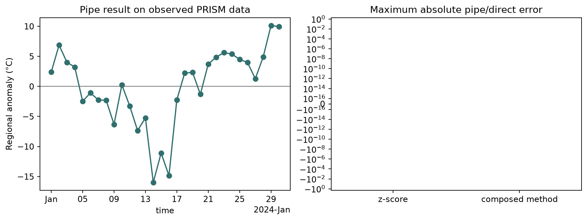
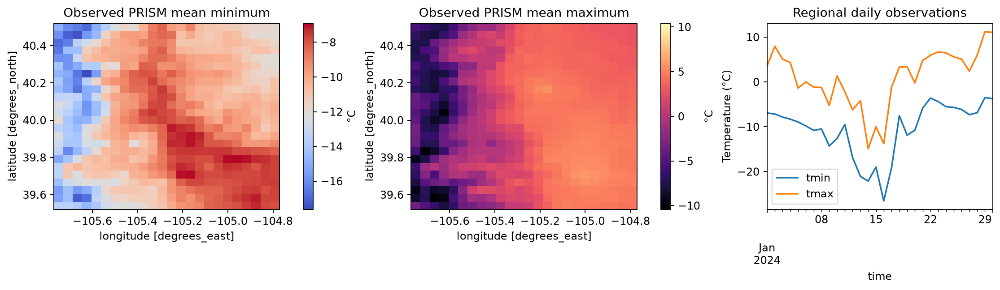

<section class="cd-editorial-hero">
  

    
 Open-source methods for spatiotemporal research

    <h1>A composable grammar for spatiotemporal science.</h1>
    
CubeDynamics provides a transparent, streaming-aware way to express environmental analyses as small, testable operations.

    

      <a class="cd-action cd-action--acid" href="grammar/">Read the core methods →</a>
      <a class="cd-action cd-action--ghost" href="vignettes/">Run a vignette ↗</a>
    

  

  

    

      

        <iframe src="assets/figures/prism_boulder_tmax_cube.html" title="Interactive cube of observed PRISM daily maximum temperature" loading="eager" sandbox="allow-scripts allow-same-origin" allowfullscreen></iframe>
      

      

        
<strong>Live CubeDynamics viewer</strong>Observed PRISM temperature · longitude × latitude × time

        <a href="assets/figures/prism_boulder_tmax_cube.html">Open full viewer ↗</a>
      

      
Drag the cube to rotate it. Scroll over the viewer to zoom.

    

  

</section>

<section class="cd-manifesto">
  

  
Research design

  <h2>A stable grammar for transparent, extensible analysis.</h2>
  

    
CubeDynamics separates a small computational framework from the domain-specific methods developed by research projects.

    
Researchers can compose operations while keeping space, time, metadata, and analytical intent visible. Project assumptions remain explicit in custom verbs instead of becoming hidden framework behavior.

  

</section>

<section class="cd-grammar-strip" aria-label="CubeDynamics grammar example">
  

  

    
Computational model

    <h2>Readable workflows. Explicit operations.</h2>
  

  

    <pre><code>from cubedynamics import pipe, verbs as v

result = (
    pipe(cube)
    | v.anomaly(dim="time")
    | v.mean(dim=("y", "x"))
).unwrap()</code></pre>
    
The same expression works with in-memory arrays and Dask-backed data while preserving a reviewable record of the analysis.

  

</section>

<section class="cd-stories">
  

  

    

      
Reproducible examples

      <h2>From method to implementation.</h2>
    

    
Eight independent notebooks move from arrays, tables, and Datasets through core verbs, events, custom vocabulary, and lazy computation. Every example ends in a plot.

  

  

    <a class="cd-story cd-story--feature" href="vignettes/">
      

        PIPE
        |
        VERB
      

      

        
01–08 · Narrative vignettes

        <h3>Learn through complete analysis stories</h3>
        
Begin with a research question, read the method as a compact pipe, and interpret what the figure reveals.

        Open the complete learning path →
      

    </a>

    <a class="cd-story" href="vignettes/lazy_composition/">
      

        
      

      

        
02 · Computational scaling

        <h3>Lazy composition</h3>
        
Verify that Dask-backed data remain lazy across an ordinary CubeDynamics pipeline.

        Examine the computation →
      

    </a>

    <a class="cd-story" href="extending/custom_verbs/">
      

        
      

      

        
03 · Research extensions

        <h3>Project-specific verbs</h3>
        
Encode a project’s methods and assumptions as a small, documented, and tested vocabulary.

        Author a custom verb →
      

    </a>
  

</section>

<section class="cd-layers">
  

    
Software architecture

    <h2>A clear boundary between framework and research.</h2>
  

  <ol class="cd-layer-list">
    <li>01
<strong>Core grammar</strong>
<code>pipe</code>, <code>Pipe</code>, verb factories, and cube contracts.

</li>
    <li>02
<strong>Shared vocabulary</strong>
Common operations such as anomaly, mean, variance, and z-score.

</li>
    <li>03
<strong>Integrations</strong>
Data adapters, streaming execution, files, and renderers.

</li>
    <li>04
<strong>Project extensions</strong>
Synchrony, biology, Fire VASE, and the verbs your project owns.

</li>
  </ol>
</section>

<section class="cd-final-cta">
  

  
Documentation and reproducibility

  <h2>Inspect the method. Run the analysis.</h2>
  

    <a class="cd-action cd-action--dark" href="quickstart/">Start with the quickstart →</a>
    <a class="cd-text-link" href="concepts/core_and_projects/">Review core and project boundaries →</a>
  

</section>

