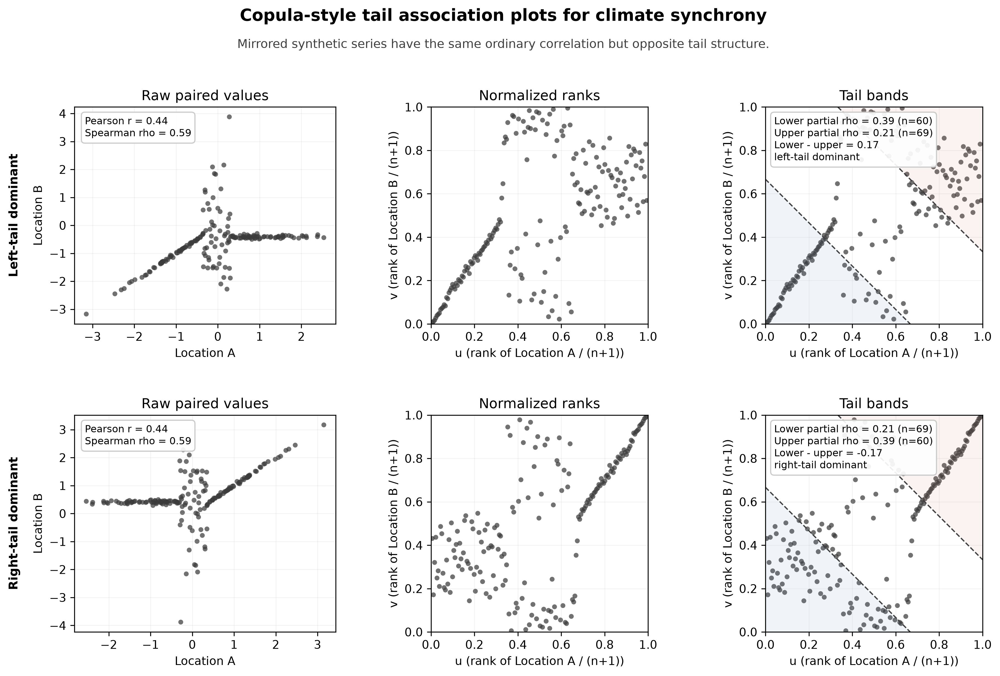

# Ghosh-Style Tail Association for Climate Synchrony

Use this recipe when two climate-synchrony series have similar ordinary
correlation but may differ in the lower and upper tails. The plotting helper
converts each series to normalized ranks, draws the diagonal tail bands used in
Ghosh-style copula diagnostics, and annotates lower- and upper-band partial
Spearman correlations.

```python
from cubedynamics.plotting import plot_tail_association_triptych

fig = plot_tail_association_triptych(
    series_a,
    series_b,
    b=1 / 3,
    labels=("Location A", "Location B"),
    outpath="tail_association_climate_sync",
)
```

Passing `outpath` writes both `tail_association_climate_sync.png` and
`tail_association_climate_sync.pdf`.

## From A Synchrony Cube

For a cube-like `xarray.Dataset`, use the extraction helper. Selectors must
reduce the cube to exactly one time series for each location, which keeps
spatial aggregation separate from plotting.

```python
from cubedynamics.plotting import plot_tail_association_from_cube

fig = plot_tail_association_from_cube(
    ds,
    var="severity_synchrony",
    selector_a={"isel": {"y": 0, "x": 0}},
    selector_b={"isel": {"y": 2, "x": 3}},
    time_dim="time",
    preprocess="zscore",
    labels=("Pixel A", "Pixel B"),
    outpath="severity_tail_association",
)
```

Plain coordinate selectors are also accepted:

```python
fig = plot_tail_association_from_cube(
    ds,
    var="severity_synchrony",
    selector_a={"y": 39.8, "x": -105.3},
    selector_b={"y": 40.1, "x": -104.9},
)
```

Available preprocessing modes are `raw`, `anomaly`, `zscore`, and `rank_only`.
The `event_binary` and `event_intensity` names are reserved until the event
threshold contract is wired into the synchrony pipeline.

## Demonstration Figure

The offline example builds mirrored synthetic pairs: one has stronger lower-tail
association and the other has stronger upper-tail association, while ordinary
Pearson and Spearman correlations remain the same.

```bash
PYTHONPATH=src python examples/ghosh_tail_association_demo.py --output-dir docs/assets/figures
```



The figure is intended as a diagnostic, not a replacement for the synchrony
estimator. Pearson and Spearman summarize the full paired relationship, while
the lower and upper diagonal bands ask whether dependence is concentrated in
cool/lower-event states, hot/upper-event states, or is approximately symmetric.
