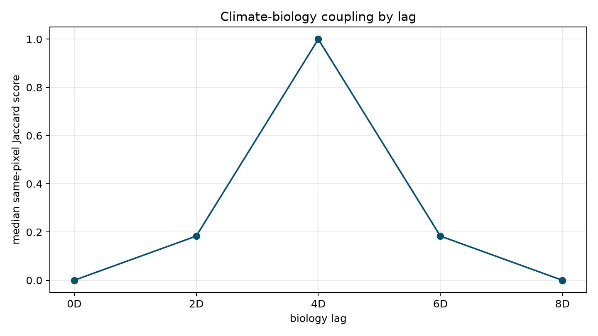

# Biological Cubes and Coupling

Within-cube synchrony asks how one process varies across space. Coupling asks
how two aligned processes relate to each other, such as heat events followed by
a biological response.

## Rasterize Observations

```python
bio_cube = v.rasterize_observations(
    observations,
    template=climate_cube,
    time_col="date",
    value_col="abundance",
    reducer="sum",
)
```

Missing observations stay as `NaN`. That keeps unobserved cells distinct from
observed zeros.

## Align to Climate

```python
bio_aligned = (
    pipe(bio_cube)
    | v.align_cube(
        like=climate_cube,
        spatial_method="nearest",
        temporal_method="nearest",
        tolerance="15D",
    )
).unwrap()
```

Alignment metadata records the spatial and temporal methods used.

## Build a Biological State

```python
boom = (
    pipe(bio_aligned)
    | v.change_state(
        change="relative",
        threshold=0.5,
        lag="1Y",
        name="population_boom",
    )
).unwrap()
```

## Compare With Climate

```python
climate_biology = (
    pipe(hot_state)
    | v.sync_with(
        boom,
        synchrony="occurrence",
        spatial_relation="same_pixel",
        lags=["0D", "90D", "180D", "365D"],
    )
).unwrap()
```

Positive lags mean the right-hand cube is interpreted as responding after the
left-hand climate cube. In the synthetic example below, the response was
constructed four days after the climate state, and the coupling curve peaks at
`4D`.



## Current Scope

`v.sync_with` currently supports same-pixel lagged occurrence coupling. The
roadmap includes cross-location coupling, event graphs, permutation or null
diagnostics, and sequence verbs, but those should wait until their statistical
contracts are clear.
