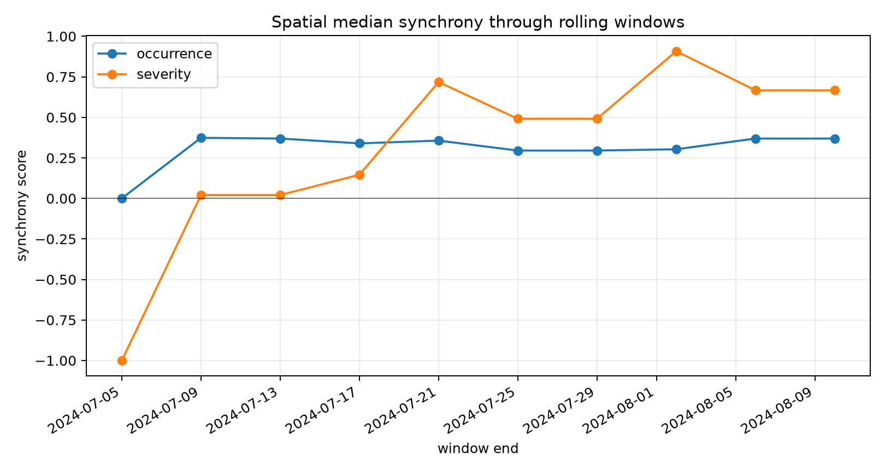

# Synchrony

Synchrony asks when places, events, or biological responses move together. In
CubeDynamics, it is a grammar:

```text
raw cube -> state cube -> event result -> synchrony operator -> spatial summary
```

That separation matters. A threshold rule should not be tangled up with a
spatial comparison choice, and a center pixel should not define the whole idea
of synchrony.

<div class="sync-pill-row">
  <span class="sync-pill">state cubes</span>
  <span class="sync-pill">event catalogs</span>
  <span class="sync-pill">occurrence</span>
  <span class="sync-pill">severity</span>
  <span class="sync-pill">timing</span>
  <span class="sync-pill">duration</span>
  <span class="sync-pill">biology coupling</span>
</div>

## Start Here

<div class="sync-card-grid">
  <div class="sync-card">
    <h3><a href="theory/">Theory Map</a></h3>
    <p>Ecological synchrony, Moran effects, event synchronization, climate networks, and compound events.</p>
  </div>
  <div class="sync-card">
    <h3><a href="state_events/">State and Events</a></h3>
    <p>Turn raw climate or biological values into standard state cubes and event catalogs.</p>
  </div>
  <div class="sync-card">
    <h3><a href="primitives/">Four Primitives</a></h3>
    <p>Compare occurrence, severity, timing, and duration with shared spatial modes.</p>
  </div>
  <div class="sync-card">
    <h3><a href="biology_coupling/">Biology Coupling</a></h3>
    <p>Rasterize observations, align cubes, and compare lagged climate-biology states.</p>
  </div>
</div>

## The First Visual

This synthetic cube shows occurrence synchrony: nearby pixels become similar
when hot-state events occur at the same times. Drag the cube to inspect the
time-depth and spatial faces.

<div class="interactive-embed">
  <iframe
    src="/cubedynamics/assets/figures/synchrony_occurrence_cube.html"
    title="Interactive occurrence synchrony cube"
    loading="lazy"
  ></iframe>
  <p class="interactive-embed__fallback">
    If the occurrence synchrony cube does not load,
    <a href="/cubedynamics/assets/figures/synchrony_occurrence_cube.html" target="_blank" rel="noopener">open it in a new tab</a>.
  </p>
</div>

## Why Four Operators?

Two locations can be synchronized in one sense and independent in another:

- Occurrence: did the state happen at the same times?
- Severity: were magnitudes high together when both were active?
- Timing: did matched events begin, peak, or end together?
- Duration: did matched events persist for similar lengths of time?

The plot below shows why the distinction is useful. In the same synthetic
system, occurrence and severity tell different stories through rolling windows.



<p class="figure-note">
Synthetic validation case generated by <code>examples/synchrony_section_assets.py</code>.
</p>

## Core Pattern

```python
from cubedynamics import pipe, verbs as v

hot = (
    pipe(tmax_cube)
    | v.threshold_state(threshold=35, direction="above")
).unwrap()

events = (
    pipe(hot)
    | v.detect_events(state_var="state", min_duration=2, max_gap=1)
).unwrap()

occurrence = (
    pipe(hot)
    | v.occurrence_synchrony(spatial_mode="neighbors", radius_km=100)
).unwrap()
```

Read next: [State and Events](state_events.md), then
[Four Primitives](primitives.md).
