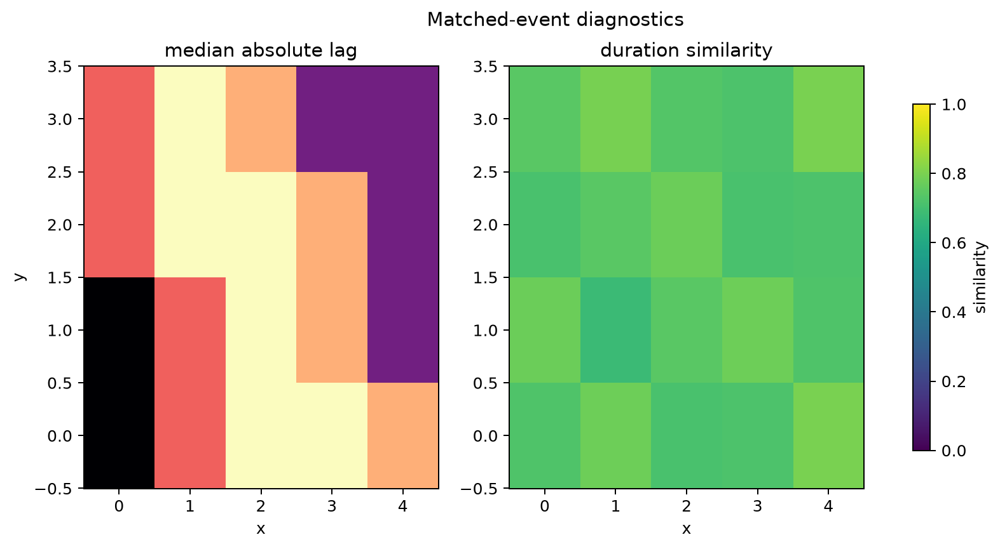

# State Cubes and Events

Synchrony starts by turning raw values into explicit states. This keeps the
rule for defining an event separate from the operator used to compare events.

## State Cube Contract

Every state constructor returns an `xarray.Dataset` with:

- `state`: boolean active/inactive condition.
- `magnitude`: distance beyond the threshold.
- `threshold`: scalar or broadcast threshold used to define the state.

```python
from cubedynamics import pipe, verbs as v

hot = (
    pipe(tmax_cube)
    | v.threshold_state(
        threshold=35.0,
        direction="above",
        name="hot_state",
    )
).unwrap()
```

Quantile states use each pixel's distribution or a rolling window:

```python
cold = (
    pipe(tmin_cube)
    | v.quantile_state(
        quantile=0.5,
        direction="below",
        rolling_window=90,
        name="cold_state",
    )
).unwrap()
```

Binary masks can be normalized with `v.binary_state()`, and biological response
states can be built with `v.change_state()`.

## Event Result Contract

Timing and duration synchrony need event identity. `v.detect_events()` turns
contiguous `True` runs into an `EventResult`:

```python
events = (
    pipe(hot)
    | v.detect_events(
        state_var="state",
        magnitude_var="magnitude",
        min_duration=2,
        max_gap=1,
    )
).unwrap()

events.dataset
events.catalog
```

The Dataset contains event variables such as `event_active`, `event_id`,
`event_age`, `event_duration`, `event_peak`, `event_mean`, `event_integral`,
`sequence_index`, and `time_since_previous_event`.

The catalog is a pandas DataFrame with one row per event. It stays outside
xarray attrs so large event tables remain visible and inspectable.

## Matched-Event Diagnostics

The static panel below shows two event-level diagnostics: lag between matched
events and duration similarity.



<p class="figure-note">
Black cells in the lag map indicate unmatched or unavailable event timing.
</p>

## Recreate the Website Assets

```bash
PYTHONPATH=src MPLCONFIGDIR=/private/tmp \
  .venv/bin/python examples/synchrony_section_assets.py \
  --output-dir docs/assets/figures
```
