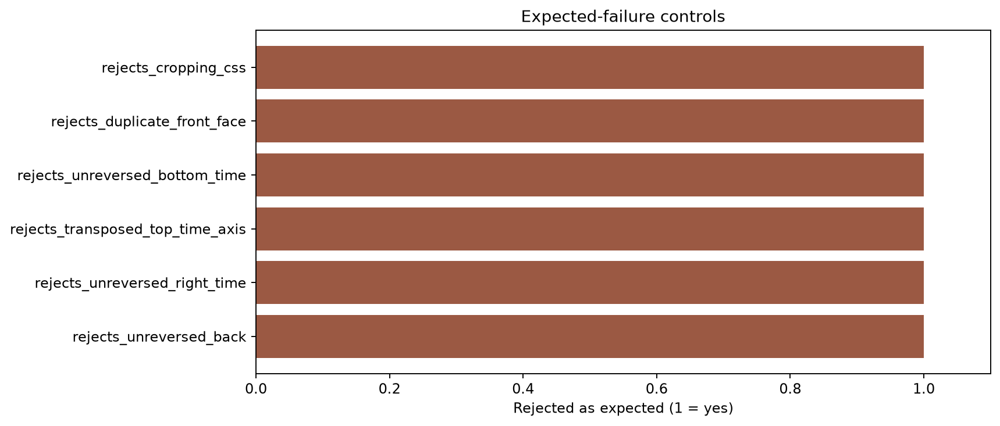

# Expected-failure controls

A suite that passes only its intended output may still be insensitive to the
defect that matters. The contrast module deliberately introduces known errors
and requires every one to fail comparison.

The current controls are:

- oldest/back values without the declared x reversal;
- right-face time in the wrong direction;
- a transposed top-face time axis;
- bottom-face time in the wrong direction;
- a duplicate front face in the HTML shell; and
- the previous cropping rule for rectangular face textures.

All six are rejected. These controls specifically cover the class of side-face
problem visible in the earlier vignette output; they are not substitute data
examples and never appear in the educational lessons.
