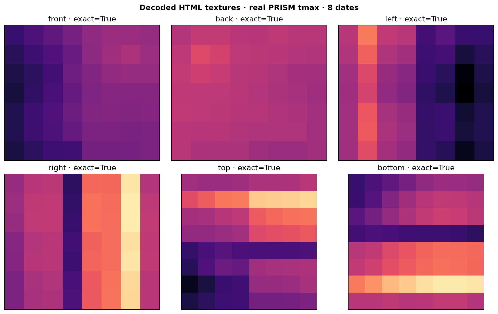

# Validation

CubeDynamics treats examples as scientific outputs. The publication gate runs
five independent modules covering checksum-controlled real inputs, grammar,
cube rendering, notebook execution, and deliberate failure controls.

**Published PRISM baseline: PASS — 5 of 5 modules.** New source candidates have
[separate production review gates](../data/source_projects/production.md);
successful fixture checks do not make them production-certified.

| Module | What it validates | Evidence |
| --- | --- | --- |
| Real data | source, checksum, dimensions, dates, coordinates, units, finite values, physical relationships, and 60 source archive records | [Data report](data.md) |
| Grammar | direct xarray calculations agree with equivalent `pipe(cube) \| verb()` expressions | [Methods](methods.md) |
| Cube / HTML | six unique faces, complete uncropped textures, declared direction on every axis, and exact RGBA pixels | [Cube report](cube.md) |
| Vignettes | core and source lessons name an explicitly supported real fixture, verify its provenance/checksums, execute offline, emit plots, and keep generated examples out of public learning routes | [Methods](methods.md) |
| Contrast | known reversals, transpositions, duplicate faces, and cropping behavior are rejected | [Contrast report](contrast.md) |



The default suite is offline: CI validates the checked-in fixtures rather than
silently substituting generated data when a service is unavailable. Rebuilding
the fixture is a separate, explicit, checksum-verified acquisition step.

## Run it

```bash
python -m pip install -e ".[dev]"
python scripts/run_validation.py --run-vignettes
```

The command writes one `result.json` and one PNG per module, a suite manifest,
and a collated PDF under `artifacts/validation/`. Any failed acceptance check or
notebook exits nonzero.

- [Suite manifest](../assets/validation/suite_manifest.json)
- [Collated validation report](../assets/validation/validation_report.pdf)

This design follows the evidence-oriented pattern used by the
[Fire VASE validation suite](https://cu-esiil.github.io/fire_vase/validation/):
modular checks, visual evidence, machine-readable artifacts, and expected-
failure controls.
